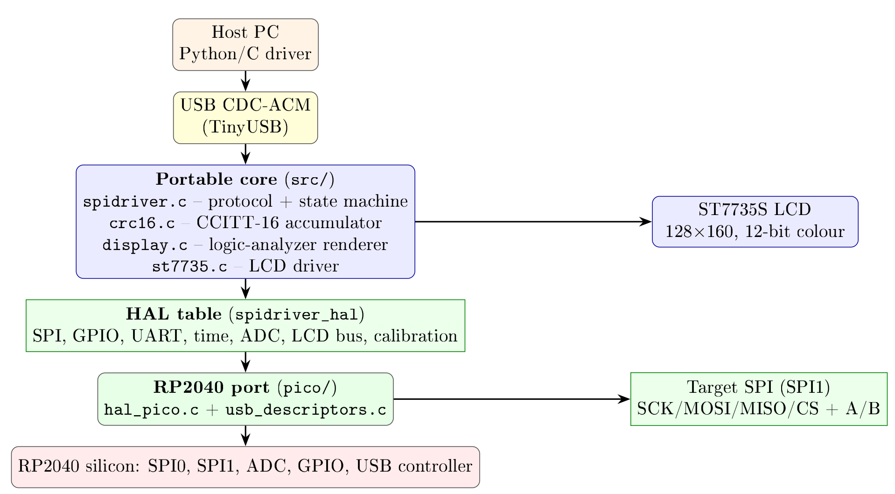

Full documentation is at
[spidriver.com](https://spidriver.com).

SPIDriver is a tool for controlling any SPI device from your PC's USB port.
It connects as a standard USB serial device, so there are no drivers to install.
The serial protocol is [very simple](/protocol.md),
and there are included drivers for

* Windows/Mac/Linux GUI
* Windows/Mac/Linux command-line
* Python 2 and 3
* Windows/Mac/Linux C/C++

## Firmware for the Raspberry Pi Pico

The original SPIDriver firmware is written in [MyForth](http://www.kiblerelectronics.com/myf/myf.shtml)
for the Silabs EFM8BB10.
It has been ported to portable C, targeting the Raspberry Pi Pico (RP2040) first.

The portable core is in [`firmware-c/src`](firmware-c/src), with the RP2040 port in
[`firmware-c/pico`](firmware-c/pico).
It implements the same host protocol (drop-in compatible with the included drivers),
CCITT-16 CRC, USB-voltage/current/temperature measurement and the ST7735S logic-analyzer
display.

See [`firmware-c/README.md`](firmware-c/README.md) for the pin map, build instructions and
port details.

A technical deep-dive of the RP2040 implementation is in
[`firmware-c/docs/rp2040-overview.md`](firmware-c/docs/rp2040-overview.md)
(also as [LaTeX](firmware-c/docs/rp2040-overview.tex) and
[PDF](firmware-c/docs/rp2040-overview.pdf)).

## Contributed language bindings

The following bindings were contributed by SPIDriver community members:

* **.net** <https://github.com/alandoherty/spidriver-net>
* **rust** <https://docs.rs/spidriver/0.1.0/spidriver/>

[spidriver.com](https://spidriver.com)
