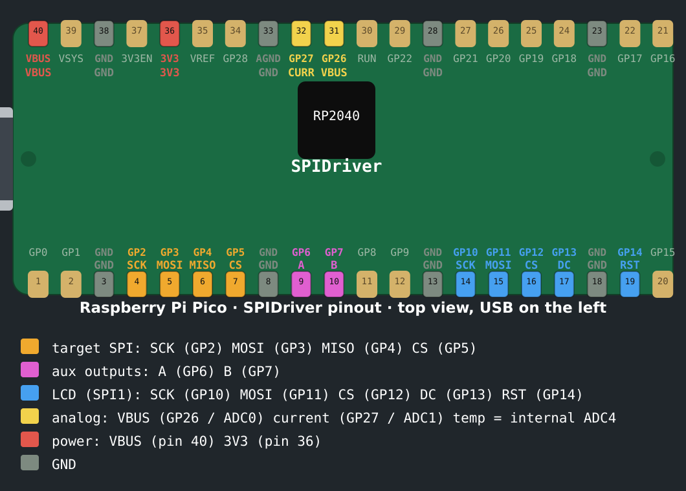

# SPIDriver firmware — portable C port (RP2040)

A C port of the SPIDriver firmware, which was originally written in
[MyForth](http://www.kiblerelectronics.com/myf/myf.shtml) for the Silabs
EFM8BB10 (8051). This port targets the Raspberry Pi Pico (RP2040) but keeps
all protocol/display/measurement logic in a portable core (`src/`) behind a
small hardware-abstraction table, so other MCUs only need a new HAL.

## What is implemented

* **Host protocol** (drop-in compatible with the Python driver and host tools):
  * `?` — 80-byte status line: product, serial, uptime, VBUS voltage, target
    current, temperature, A/B/CS state, CRC16.
  * `e <b>` — echo.
  * `s` / `u` — SPI chip-select assert / deassert.
  * `a <b>` / `b <b>` — set auxiliary signal A / B from the byte's LSB.
  * `x` — disconnect (tri-state the SPI pins).
  * `0x80-0xBF` — duplex: send N bytes, return N received bytes.
  * `0xC0-0xFF` — write-only: send N bytes.
  * N = `(cmd & 0x3F) + 1`.
* **CCITT-16 CRC** — CRC-16/XMODEM accumulator over all SPI TX/RX bytes; the
  status line reports the bit-reversed value, matching the EFM8 hardware CRC
  unit's `CRCPNT=11` positioning.
* **Measurements** — VBUS voltage, target current and die temperature, each
  via a 4-sample box average + exponential moving average (alpha 1/8, exactly
  like the original `ema` word).
* **ST7735S display** — the logic-analyzer view: top readings row, six labelled
  waveform strips (SCK, MISO, MOSI, CS, A, B), hex annotation rows and CS/A/B
  indicator boxes. Fonts are regenerated from the same source material
  (IBM Plex Sans SemiBold and `hex4x5.png`).

## Layout

```text
src/            portable core (no Pico dependencies)
  spidriver.h   HAL interface + public API
  spidriver.c   protocol engine, CRC, measurements, main loop
  crc16.[ch]    CCITT-16 (XMODEM)
  st7735.[ch]   portable ST7735S driver (12-bit color)
  display.[ch]  waveform/label/annotation rendering
  fonts.h       generated glyph data (tools/genfonts.py)
pico/           RP2040 port
  hal_pico.c    HAL implementation + main()
  usb_descriptors.[ch]  CDC-ACM USB descriptors
host/           POSIX test HAL (builds the core on a PC)
tusb_config.h   TinyUSB configuration
tools/genfonts.py  font generator (run once; output committed)
```

## RP2040 pin map



([SVG source](images/pico-pinout.svg) — regenerate with `tools/genpinout.py`.)

| GPIO | Function |
| --- | --- |
| 2 | SCK (LCD, SPI0) |
| 3 | MOSI / SDA (LCD) |
| 4 | DC / RS / A0 (LCD, data/command) |
| 5 | CS (LCD) |
| 6 | A (auxiliary signal) |
| 7 | B (auxiliary signal) |
| 8 | MISO (target SPI1) |
| 9 | CS (target SPI1) |
| 10 | SCK (target SPI1) |
| 11 | MOSI (target SPI1) |
| 26 | VBUS sense (ADC0) |
| 27 | current sense (ADC1) |
| — | internal ADC4 = temperature |

Both SPI buses are hardware SPI (no bit-banging). LCD RESET is not wired;
tie it to 3V3, as on the original board. The target MOSI sits on GP11
(pin 15): RP2040 hardware-SPI pins come in fixed sets, so no complete
SPI set fits inside physical pins 9-13.

Edit the `PIN_*` defines at the top of `pico/hal_pico.c` to rewire.

The transport is USB CDC (native RP2040 USB). The original board's FT232RL
UART is unnecessary; a Pico enumerates as `/dev/ttyACMx` and the existing
Python driver works unchanged.

## Calibration

Calibration values are set in `hal_pico.c` and are in **raw16** units
(`raw16 = raw12 << 4`, i.e. full-scale 12-bit ADC mapped to 16 bits). The
core scales a measurement as `value = raw16 * cal / 65536`.

| Constant | Value | Derivation |
| --- | --- | --- |
| `cal_vbus_mv` | 8250 | 3.3 V ref; original divider gives Vbus = 2.5 × Vpin. |
| `cal_current_ma` | 1375 | ZXCT1110 with Rs=0.1 Ω, Rg=2.4 kΩ → 2.4 V/A. |
| `cal_current_zero` | 0 | raw16 offset subtracted before scaling. |
| `cal_temp_coef` | 19173 | RP2040 temp sensor slope, deci-C per raw16. |
| `cal_temp_offset` | 4372 | deci-C at raw16 == 0 (`27 + 0.706/0.001721` in deci-C). |

Adjust `cal_vbus_mv` and `cal_current_ma` to match your divider/sense
circuit. See the doc comments in `src/spidriver.h` for the exact semantics.

## Building

```sh
export PICO_SDK_PATH=/path/to/pico-sdk
cmake -B build -DCMAKE_EXPORT_COMPILE_COMMANDS=ON
cmake --build build -j
```

Flash `build/spidriver_pico.uf2` (hold BOOTSEL, copy the file to the RPI-RP2
drive).

### Host (PC) build for testing

```sh
gcc -std=c11 -Isrc -o build/spidriver_host \
    src/crc16.c src/st7735.c src/display.c src/spidriver.c host/hal_host.c
printf '?' | ./build/spidriver_host        # print one status line
```

## Differences from the original firmware

* **Transport**: USB CDC instead of FTDI UART. Baud rate is ignored.
* **SPI clock**: default 500 kHz to match the original; change `SPI_TARGET_HZ`.
* **Duplex transfer**: the original clocks each byte once per command (the
  read command buffers the payload and re-clocks it — there is no double
  clocking on the wire); this port keeps a single clock per byte.
* **Display orientation**: drawn in literal portrait coordinates
  (`ST7735_MADCTL`, default `0x08`). Flip it to `0xC8` if your panel is
  mounted upside down.
* **Waveform layout** is a faithful re-implementation rather than a
  pixel-identical copy of the 8051's rotated-window streaming code; the same
  six rows, entry widths (7/18/18/8) and annotation scheme are used.
* **Box indicator** clears its outline when the signal is low (the original
  left a stale outline).
* **Serial string**: derived from the RP2040 unique board id.
* **Boot colorbar self-test**: at boot the panel shows an 8-color test bar
  for 1.5 s, then the normal screen.
* **1200-baud reflash**: opening the port at 1200 baud reboots into BOOTSEL
  (Arduino convention), so firmware updates need no button press.

## Documentation

A technical deep-dive of the RP2040 implementation is in
[`docs/rp2040-overview.md`](docs/rp2040-overview.md) — architecture, pin map,
USB CDC transport, host protocol, CRC, measurements, display rendering and
build steps. LaTeX source and a rendered PDF live alongside:
[`docs/rp2040-overview.tex`](docs/rp2040-overview.tex),
[`docs/rp2040-overview.pdf`](docs/rp2040-overview.pdf).

## License

Same terms as the upstream project (see the repository root `LICENSE`).
